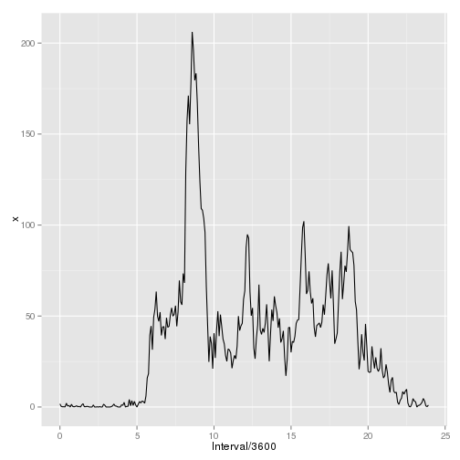

# Reproducible Research: Peer Assessment 1

## Loading and preprocessing the data
Assessment data will be loaded directly from zip file:

```r
assessment.data <- read.csv(unzip("activity.zip", "activity.csv"))
```
Lets examine structure of crated data frame:

```r
str(assessment.data)
```

```
## 'data.frame':	17568 obs. of  3 variables:
##  $ steps   : int  NA NA NA NA NA NA NA NA NA NA ...
##  $ date    : Factor w/ 61 levels "2012-10-01","2012-10-02",..: 1 1 1 1 1 1 1 1 1 1 ...
##  $ interval: int  0 5 10 15 20 25 30 35 40 45 ...
```
We can see that data type for **date** is *Factor*, and it probably should be *Date*. Let's adjust that:

```r
assessment.data$date <- as.Date(assessment.data$date)
```
Lets also convert interval to timestamp format. First, lets use strptime to extract timestamp:

```r
assessment.data$interval <- as.integer(as.POSIXct(strptime(
  formatC(assessment.data$interval, width = 4, format = "d", flag = "0"), 
  format = "%H%M")))
```
And then subtract first timestamp to have proper timing:

```r
assessment.data$interval <- assessment.data$interval - assessment.data$interval[1]
```
Simple summary of read data:

```r
summary(assessment.data)
```

```
##      steps            date               interval    
##  Min.   :  0.0   Min.   :2012-10-01   Min.   :    0  
##  1st Qu.:  0.0   1st Qu.:2012-10-16   1st Qu.:21525  
##  Median :  0.0   Median :2012-10-31   Median :43050  
##  Mean   : 37.4   Mean   :2012-10-31   Mean   :43050  
##  3rd Qu.: 12.0   3rd Qu.:2012-11-15   3rd Qu.:64575  
##  Max.   :806.0   Max.   :2012-11-30   Max.   :86100  
##  NA's   :2304
```
## What is mean total number of steps taken per day?
Sum of steps for each day. Steps variable is **x**:

```r
total.steps.day <- aggregate.data.frame(x = assessment.data$steps, by = list(Date = assessment.data$date), sum, na.rm = TRUE)
head(total.steps.day)
```

```
##         Date     x
## 1 2012-10-01     0
## 2 2012-10-02   126
## 3 2012-10-03 11352
## 4 2012-10-04 12116
## 5 2012-10-05 13294
## 6 2012-10-06 15420
```
Histogram:

```r
hist(total.steps.day$x, main = "Histogram of total steps per day", xlab = "Sum of steps per day")
```

 

Mean and median values:

```r
mean.steps <- mean(total.steps.day$x, na.rm = T)
median.steps <- median(total.steps.day$x, na.rm = T)
mean.steps
```

```
## [1] 9354
```

```r
median.steps
```

```
## [1] 10395
```

## What is the average daily activity pattern?
Lets load plotting library:

```r
library("ggplot2")
```
Average of steps for each interval. Steps variable is **x**:

```r
mean.steps.interval <- aggregate.data.frame(x = assessment.data$steps, by = list(Interval = assessment.data$interval), mean, na.rm = TRUE)
head(mean.steps.interval)
```

```
##   Interval       x
## 1        0 1.71698
## 2      300 0.33962
## 3      600 0.13208
## 4      900 0.15094
## 5     1200 0.07547
## 6     1500 2.09434
```
Plot:

```r
ggplot(mean.steps.interval, aes(Interval/3600,x)) + geom_line() 
```

 

Time interval which has highest average steps count:

```r
intense.time <- mean.steps.interval$Interval[which.max(mean.steps.interval$x)]
format(as.POSIXct('0001-01-01 00:00:00') + intense.time, "%I:%M:%S %p") 
```

```
## [1] "08:35:00 "
```
## Imputing missing values
### Number of missing values:
We know from previous summary, that column which can have NA's is column *steps*. So to know number of missing cases, we only need to examine NA's in *steps*:

```r
total.rows <- nrow(assessment.data)
missing.rows <- sum(is.na(assessment.data$steps))
percent.missing <- (missing.rows/total.rows)*100
```
Results are: we have 17568 total rows, from which 2304 contains missing values - that is 13.1148 percent of all rows.
### Filling missing values:
I decided to fill missing values based on mean value for that time interval. For each missing value, its interval will be taken. For this interval, number of mean steps *x* will be taken from calculated previously *mean.steps.interval* data frame.
### Creating new dataset with filled missing values

```r
new.data <- assessment.data
for (i in which(is.na(new.data$steps))) {
  new.data$steps[i] <- mean.steps.interval$x[mean.steps.interval$Interval == new.data$interval[i]]
}
head(new.data)
```

```
##     steps       date interval
## 1 1.71698 2012-10-01        0
## 2 0.33962 2012-10-01      300
## 3 0.13208 2012-10-01      600
## 4 0.15094 2012-10-01      900
## 5 0.07547 2012-10-01     1200
## 6 2.09434 2012-10-01     1500
```
### Comparing with data containing NA
I will run the same analytics like in second paragraph:
Sum of steps for each day. Steps variable is **x**:

```r
total.steps.day <- aggregate.data.frame(x = new.data$steps, by = list(Date = new.data$date), sum)
head(total.steps.day)
```

```
##         Date     x
## 1 2012-10-01 10766
## 2 2012-10-02   126
## 3 2012-10-03 11352
## 4 2012-10-04 12116
## 5 2012-10-05 13294
## 6 2012-10-06 15420
```
Histogram:

```r
hist(total.steps.day$x, main = "Histogram of total steps per day", xlab = "Sum of steps per day")
```

 

Mean and median values:

```r
mean.steps <- mean(total.steps.day$x)
median.steps <- median(total.steps.day$x)
mean.steps
```

```
## [1] 10766
```

```r
median.steps
```

```
## [1] 10766
```
After filling missing values, both mean and median are slightly higher.
## Are there differences in activity patterns between weekdays and weekends?
### Adding new factor variable to dataset:

```r
Sys.setlocale(category = "LC_TIME", locale = "C") # fixing locales
```

```
## [1] "C"
```

```r
new.data$day <- weekdays(new.data$date)
new.data$day <- ifelse(new.data$day %in% c("Monday", "Tuesday", "Wednesday", "Thursday", "Friday"), "weekday", "weekend")
```
### Calculating separate means for weekend and weekdays:
Aggregation method as previously. I will create two separated data frames with means for each day type and them merge them togeather:

```r
mean.steps.interval.weekend <- aggregate.data.frame(x = new.data$steps[new.data$day == "weekend"], by = list(Interval = new.data$interval[new.data$day == "weekend"]), mean)
head(mean.steps.interval.weekend)
```

```
##   Interval        x
## 1        0 0.214623
## 2      300 0.042453
## 3      600 0.016509
## 4      900 0.018868
## 5     1200 0.009434
## 6     1500 3.511792
```

```r
mean.steps.interval.weekday <- aggregate.data.frame(x = new.data$steps[new.data$day == "weekday"], by = list(Interval = new.data$interval[new.data$day == "weekday"]), mean)
head(mean.steps.interval.weekday)
```

```
##   Interval       x
## 1        0 2.25115
## 2      300 0.44528
## 3      600 0.17317
## 4      900 0.19790
## 5     1200 0.09895
## 6     1500 1.59036
```

```r
merged.mean.steps <- merge(mean.steps.interval.weekday, mean.steps.interval.weekend, by = "Interval")
names(merged.mean.steps) <- c("interval", "weekday", "weekend")
```
Plotting:

```r
par(mfrow=c(2,1))
plot(merged.mean.steps$interval/3600,merged.mean.steps$weekday, main="Mean steps for each interval during weekdays", type = "l", xlab = "Interval", ylab = "Mean number of steps")
plot(merged.mean.steps$interval/3600,merged.mean.steps$weekend, main="Mean steps for each interval during weekends", type = "l", xlab = "Interval", ylab = "Mean number of steps")
```

 
